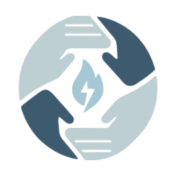

<div align="center">
  
  <h1>Zhago</h1>
  <p>🔥 Open-source FGC production toolkit — scoreboards, overlays, brackets & player stats for TOs who run the scene. Hands fight. 👊</p>

  <p><i>From Chibcha: <b>chihizhagó</b> — "hands fight"</i></p>

  [](LICENSE)
  [](https://go.dev)
  [](https://vuejs.org)
  [](https://wails.io)
  [](https://discord.gg/your-link)

  <br />

  [Download](#download) · [Features](#features) · [Quick Start](#quick-start) · [Docs](https://zhago-fgc.github.io/zhago-docs) · [Discord](https://discord.gg/your-link)
</div>

<br />

<div align="center">
  
</div>

---

## Features

🎮 **Bracket-driven workflow** — select a match, scoreboard appears inline. No tab-switching during sets.

📡 **Real-time overlays** — SSE-powered overlays for OBS. Scoreboard, commentary, lower thirds, top 8, BRB timer.

🏆 **Start.gg integration** — import any tournament. Players, brackets, and sets sync automatically.

👥 **Player stats** — win/loss, character usage, placement history. Aggregated across all events.

🎨 **Custom overlays** — create your own overlay types with custom data fields. Not limited to built-in types.

🎮 **180+ game support** — character portraits with per-game team sizes (1 for SF6, 2 for 2XKO, 3 for UMvC3).

📱 **LAN control** — station operators update scores from their phones. No internet required.

🖥️ **Cross-platform** — Windows, macOS, Linux. Single binary, works offline.

<div align="center">
  
  
</div>

## Download

| Platform | Download |
|----------|----------|
| Windows  | [zhago-windows-amd64.zip](https://github.com/zhago-fgc/zhago/releases/latest) |
| macOS    | [zhago-darwin-amd64.zip](https://github.com/zhago-fgc/zhago/releases/latest) |
| Linux    | [zhago-linux-amd64.zip](https://github.com/zhago-fgc/zhago/releases/latest) |

> No install required — extract and run.

## Quick Start

1. Download and launch Zhago
2. Create a tournament or import from Start.gg
3. In OBS, add a Browser Source → `http://localhost:3000/scoreboard/index.html`
4. Set size to 1920×1080, enable "Shutdown source when not visible"
5. Select a match from the bracket and start running sets

## Overlay Types

Zhago ships with default overlays, but you can create custom overlay types with their own data fields:

| Default Overlays | OBS URL |
|-----------------|---------|
| Scoreboard | `localhost:3000/scoreboard/index.html` |
| Commentary | `localhost:3000/commentary/index.html` |
| Top 8 | `localhost:3000/top8/index.html` |
| Break / BRB | `localhost:3000/brb/index.html` |

Custom overlays subscribe to any SSE message type and define their own fields via `manifest.json`.

## Community

📦 **Template packs** — drop folders into `~/.zhago/templates/`
🎮 **Game assets** — character portraits at `~/.zhago/assets/`
📋 **Registry** — submit your packs to [zhago-fgc/zhago-registry](https://github.com/zhago-fgc/zhago-registry)

## Development

```bash
# Prerequisites: Go 1.24+, Bun, Wails CLI
go install github.com/wailsapp/wails/v2/cmd/wails@latest

# Run in development mode
wails dev

# Build for production
wails build
```

## Tech Stack

**Backend:** Go · SQLite (glebarez) · GORM · gorilla/mux · SSE
**Frontend:** Vue 3 · TypeScript · Tailwind CSS
**Desktop:** Wails v2
**Integrations:** Start.gg GraphQL API

## Contributing

Contributions welcome! See the [contributing guide](CONTRIBUTING.md) for details.

Branch naming: `feat/`, `fix/`, `docs/`, `refactor/`
Commits: [Gitmoji](https://gitmoji.dev/) convention

## License

[MIT](LICENSE) — use it however you want.

---

<div align="center">
  <b>Built in Bogotá 🇨🇴 for the FGC</b>
</div>
